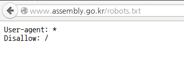

name: inverse
layout: true

---
class: title, center, middle, inverse

LOGO

# .sky[This is the title] .font-70[and the subtitle]

.footnote[
- [Lucy Park](http://twitter.com/echojuliett) @ [Team POPONG](http://en.popong.com)
- Nov 8th, 2014
]

---
.left-column[
## Abstract
]

.right-column[
This talk consists of two parts.

- One, lorem ipsum
- Two, lorem lorem ipsum

> - Some other links and stuff
]

---
# 박은정 .small.gray[a.k.a., [lucypark](http://lucypark.kr), [echojuliett](http://twitter.com), [e9t](http://github.com/e9t)]

.center[]

- PhDc for data mining at Seoul National University
- Team POPONG member

---
class: center, middle, inverse, full-text

# Section

---
# Page title

- Uno
- Dos
- Tres

> Fun facts
- Yi
- Er
- Sans

---
class: center, padding-0

Explanation 
.gray.font-70[of the image]

---
class: center, padding-0

<iframe src="http://en.pokr.kr/person/198023" width="100%" height="800px">

---
class: center, middle, inverse, full-text

감사합니다 :D

.list-none[
- [me@lucypark.kr](mailto:me@lucypark.kr)
- [@echojuliett](http://twitter.com/echojuliett)
]

